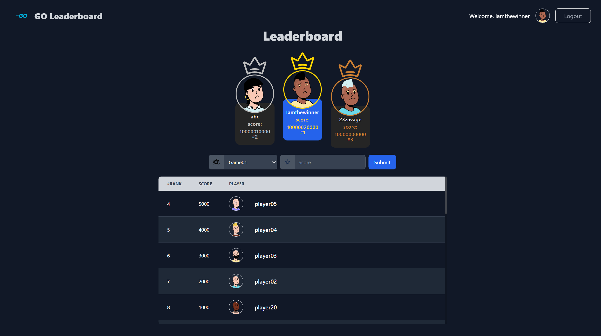

<p align="center">
    
</p>
</p>
  <h1 align="center">GO-Real-time-Leaderboard</h1>
</p>

## Project Requirements

You are to build an imaginary real-time leaderboard system that ranks users based on their scores in various games or activities. The system should meet the following requirements:

-   User Authentication: Users should be able to register and log in to the system.
-   Score Submission: Users should be able to submit their scores for different games or activities.
-   Leaderboard Updates: Display a global leaderboard showing the top users across all games.
-   User Rankings: Users should be able to view their rankings on the leaderboard.
-   Top Players Report: Generate reports on the top players for a specific period.

src: https://roadmap.sh/projects/realtime-leaderboard-system

## Notes

This project aren't completely fulfill the requirements. I'm too lazy to complete it(actually only Top players report is missing). Because I already fullfilled my learning goals.
btw you may notice it already but I didn't use any framework for frontend. because I want this to be as simple as I could.

## Setup

```bash
cd go-real-time-leaderboard
go run .
```
